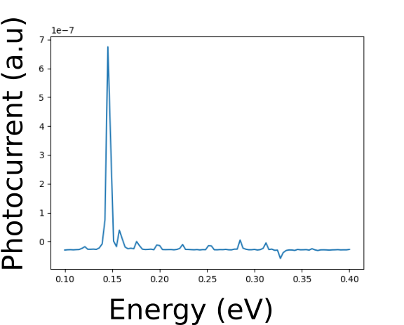

# Heterosctructures Properties Calculations

This repository contains modules for calculating properties of quantum heterostructures.

Its is possible to calculate eigenstates and eigenvalues for bound states found inside the desired structures. It is also possible to calculate photocurrent, due to photons incidence.

It is a free software, use as you wish, and please share with me the issues you find, so we can improve it together.

## Quantum well with double barrier for wavelength selection

It is a Quantum Well surrounded by two barriers. The structure is made of . It is possible to vary the barriers' length, as well as the well's length and the displacement between the barriers and the well.

The structure is carried as a two dimensional bulk, with dimensions . Where  is the wavelength of the incident photons. It allows the system to be approached as a one dimension potential in the growth direction.

Such a device allows for narrow wavelength selection window. It is possible to simulate the photocurrent due to photons with different energies.

Current peaks will be observed for photons with energies near to the difference in energy between the bound states found inside the barriers-well electron trap.

Varying the well's length, as well as the barriers' and the displacement's length, it is possible to achieve different wavelength selector devices.

We simulate a device with barriers of 5nm surrounding a well with 5nm also, displaced by 4nm. The barriers Aluminum concentration is 0.4, while the displacement's is 0.2 and well's is 0.0.

```python
>>> from algaas import BarriersWellSandwich
>>> device = BarriersWellSandwich(b_l=5.0, d_l=4.0, w_l=5.0, b_x=0.4, d_x=0.2, w_x=0.0)
>>> info = device.turn_bias_on(bias=5, core_only=True).time_evolution(imaginary=True, n=3, steps=20000).get_system_states()
>>> info[1] # eigenvalues in eV
[-0.11923426381759059, 0.033620919932281397, 0.11210729930393935]
>>> _device = info[0] # pandas dataframe
>>> _device.head()
        x_nm                                  state_0  \
0 -57.500000  (-2.11732289638e-14-3.45020783475e-14j)
1 -57.485960  (-2.12426038949e-14-3.44517064037e-14j)
2 -57.471920  (-2.13189163191e-14-3.44016523949e-14j)
3 -57.457881  (-2.13882912502e-14-3.43526907885e-14j)
4 -57.443841   (-2.14576661812e-14-3.4303521652e-14j)

                                  state_1  \
0  (1.11247707901e-13+1.01016177733e-14j)
1  (1.11075085767e-13+9.80190339333e-15j)
2  (1.10900796639e-13+9.49643805416e-15j)
3  (1.10727754368e-13+9.19117631374e-15j)
4  (1.10553411028e-13+8.88588703298e-15j)

                                   state_2
0  (-1.15567474206e-12-1.96700308092e-12j)
1   (-1.15807250098e-12-1.9658374272e-12j)
2  (-1.16045637996e-12-1.96466784432e-12j)
3  (-1.16284719891e-12-1.96349423271e-12j)
4  (-1.16522066794e-12-1.96231767182e-12j)
>>> print("Average values:")
Average values:
>>> for i in range(3): # average x
>>>     pxp = simps(np.conjugate(_device['state_{0}'.format(i)]) * _device['x_nm'] * _device['state_{0}'.format(i)], _device['x_nm'])
>>>     print('<{0}|x|{0}> = {1:.6f} nm, (total system length = {2:.6f} nm)'.format(i, pxp.real, np.ptp(_device.x_nm)))
<0|x|0> = -0.000021 nm, (total system length = 115.000000 nm)
<1|x|1> = 0.002714 nm, (total system length = 115.000000 nm)
<2|x|2> = 0.011251 nm, (total system length = 115.000000 nm)
>>> for i in range(3): # average p
>>>     _device['s{0}_d1'.format(i)] = (_device['state_{0}'.format(i)].shift(1) - _device['state_{0}'.format(i)].shift(-1)) / (2*_device['x_nm'].diff>>> ())
>>>     clean_device = _device.iloc[1:-1]
>>>     ppp = simps(np.conjugate(clean_device['state_{0}'.format(i)]) * clean_device['s{0}_d1'.format(i)], clean_device['x_nm'])
>>>     print('<{0}|p|{0}> = {1:.6e}'.format(i, ppp.real))
<0|p|0> = 8.673617e-19
<1|p|1> = -3.125552e-19
<2|p|2> = -2.168404e-19
```

It is possible to calculate the photocurrent response due to photons incidence given their energies.

```python
from multiprocessing import Pool, TimeoutError
energies = np.linspace(0.1, 0.4, 300) # energy from 100 meV to 400 meV
photocurrent = []
def get_pc(energy):
    pc = device.photocurrent(energy=energy, dt=5e-17, ep_dyn=5.0)
    now = datetime.now().strftime("%Y-%m-%d %H:%M:%S")
    print("[%s] > Energy: %.6f eV, PC: %.6e " % (now, energy, pc))
    return pc
pool = Pool(processes=4)
photocurrent = pool.map(get_pc, energies)
plt.plot(energies, photocurrent)
plt.show()
```


## References

- Chuang, S. L. (1995). Physics of optoelectronic devices. New York: Wiley. Appendix K: tables K.2 and K.3
- Mitin, V. V, V. A Kochelap, and Michael A Stroscio. Quantum Heterostructures : Microelectronics and Optoelectronics. Cambridge: Cambridge University Press, 1999.